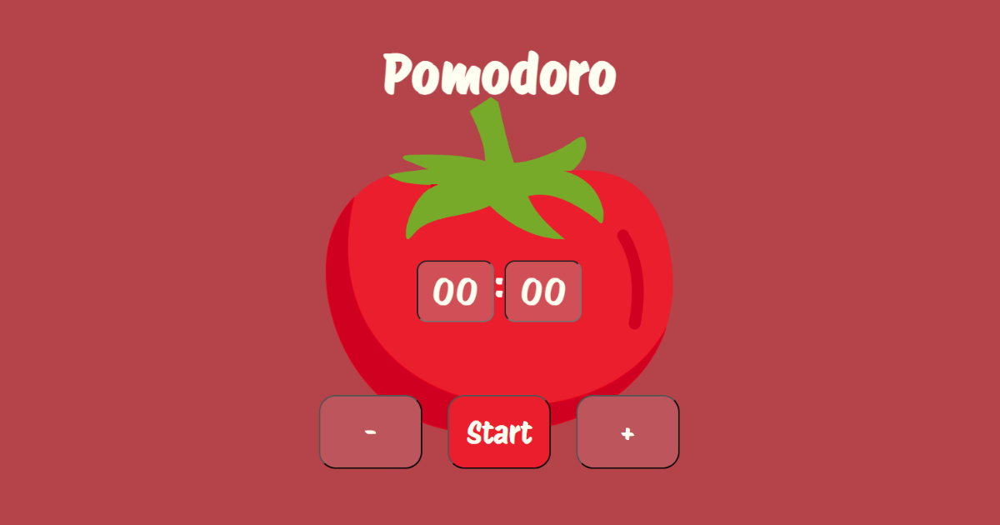

<!-- Improved compatibility of back to top link: See: https://github.com/othneildrew/Best-README-Template/pull/73 -->

<!--
*** Thanks for checking out the Best-README-Template. If you have a suggestion
*** that would make this better, please fork the repo and create a pull request
*** or simply open an issue with the tag "enhancement".
*** Don't forget to give the project a star!
*** Thanks again! Now go create something AMAZING! :D
-->

<!-- PROJECT SHIELDS -->
<!--
*** I'm using markdown "reference style" links for readability.
*** Reference links are enclosed in brackets [ ] instead of parentheses ( ).
*** See the bottom of this document for the declaration of the reference variables
*** for contributors-url, forks-url, etc. This is an optional, concise syntax you may use.
*** https://www.markdownguide.org/basic-syntax/#reference-style-links
-->

<!-- PROJECT LOGO -->
 

  

<h3 align="center">My Personal Pomodoro</h3>

<h5 href="https://lonneww.github.io/pomodoro/" align="center"> For the site click here</h5>

  

    This project is the pratical exam of the Javascript Basics start2impact University's course.  
    The task was to create a "counter" application where the user could increase or decrease the visible number by pressing one of the buttons.
     Since I often use the pomodoro tecnique to study I thought it will be more interesting, challenging and generally useful to create a timer instead of a simple counter.
  

<!-- TABLE OF CONTENTS -->

  
Table of Contents

  <ol>
    <li>
      <a href="#about-the-project">About The Project</a>
      <ul>
        <li><a href="#built-with">Built With</a></li>
      </ul>
    </li>
    <li><a href="#usage">Usage</a></li>
    <li><a href="#flaws">Flaws</a></li>
    <li><a href="#Updates">Updates</a></li>
    <li><a href="#license">License</a></li>
    <li><a href="#contact">Contact</a></li>
    <li><a href="#Feedbacks">Acknowledgments</a></li>
  </ol>

<!-- ABOUT THE PROJECT -->
## About The Project

(<a href="#readme-top">back to top</a>)

### Built With

* HTML
* CSS
* SASS
* JAVASCRIPT
  
 

(The task required to use only standard Javascript, without Jquery, frameworks or else)

(<a href="#readme-top">back to top</a>)

<!-- USAGE EXAMPLES -->
## Usage

I think most of its usage is self explanatory.  
Before you start the timer you can increase and decrease the number of minutes using the +/- buttons. If you hold the Shift key (or, with devices without keyboard, if the "shift" button is lighten up) you'll modify the number by tens.  
You also can choose to remove the ticking sound of the timer to better concentrate by clicking the stopwatch/bomb button, on the upper right of the screen.  
When you are ready, press the start button to start the timer and, if you ever need to reset it, press it again.  
At the and of the "pomodoro", a "Great job" alert will appear.

[![Product Name Screen Shot][product-screenshot]](assets/img/preview.png)

(<a href="#readme-top">back to top</a>)

<!-- FLAWS -->
## Flaws

A little list of the site's flaws:
1. The layout is not responsive with every mobile/tablet devices. It's usable and effective, but not efficient.
2. The clicking sound is not synchronized with the decreasing seconds. I tried to make it that way but since I couldn't I thought it will be better to use an obviously desinchronized audio.
3. Switching browser window while the timer is running may cause some problems. Also it doesn't notify you when it ends. You can ear the jingle at the end but I think it's not enough.

(<a href="#readme-top">back to top</a>)

<!-- UPDATES -->
## Updates

Here's a list of the updates and changes that I'd like to do in the future:
1. Making the site more customizable. Maybe like giving the possibility to choose color theme, the jingle and things like that.
2. Giving the possibility to resize and pin the window in an angle of the screen to keep track of the time.
3. Giving the possibility to organize series of timers with different tasks (like a pomodoro for working and a 10 mins pause) and timer length.
4. Making the browser memorize those informations to not lose changes or progress if the window is closed accidentally.

<!-- LICENSE -->
## License

Distributed under the MIT License. See `LICENSE.txt` for more information.

(<a href="#readme-top">back to top</a>)

<!-- CONTACT -->
## Contact

* Email lavorativa
* Linkedin
* Instagram

(<a href="#readme-top">back to top</a>)

<!-- FEEDBACKS -->
## Feedbacks

So, this is it, hope you liked the project.  
If you'd like to spend some of your time to tell me what you think about it or maybe give me some hints to how you would optimize things I'll be very, very greatfull.

(<a href="#readme-top">back to top</a>)

<!-- MARKDOWN LINKS & IMAGES -->
<!-- https://www.markdownguide.org/basic-syntax/#reference-style-links -->
[contributors-shield]: https://img.shields.io/github/contributors/github_username/repo_name.svg?style=for-the-badge
[contributors-url]: https://github.com/github_username/repo_name/graphs/contributors
[forks-shield]: https://img.shields.io/github/forks/github_username/repo_name.svg?style=for-the-badge
[forks-url]: https://github.com/github_username/repo_name/network/members
[stars-shield]: https://img.shields.io/github/stars/github_username/repo_name.svg?style=for-the-badge
[stars-url]: https://github.com/github_username/repo_name/stargazers
[issues-shield]: https://img.shields.io/github/issues/github_username/repo_name.svg?style=for-the-badge
[issues-url]: https://github.com/github_username/repo_name/issues
[license-shield]: https://img.shields.io/github/license/github_username/repo_name.svg?style=for-the-badge
[license-url]: https://github.com/github_username/repo_name/blob/master/LICENSE.txt
[linkedin-shield]: https://img.shields.io/badge/-LinkedIn-black.svg?style=for-the-badge&logo=linkedin&colorB=555
[linkedin-url]: https://linkedin.com/in/linkedin_username
[product-screenshot]: images/screenshot.png
[Next.js]: https://img.shields.io/badge/next.js-000000?style=for-the-badge&logo=nextdotjs&logoColor=white
[Next-url]: https://nextjs.org/
[React.js]: https://img.shields.io/badge/React-20232A?style=for-the-badge&logo=react&logoColor=61DAFB
[React-url]: https://reactjs.org/
[Vue.js]: https://img.shields.io/badge/Vue.js-35495E?style=for-the-badge&logo=vuedotjs&logoColor=4FC08D
[Vue-url]: https://vuejs.org/
[Angular.io]: https://img.shields.io/badge/Angular-DD0031?style=for-the-badge&logo=angular&logoColor=white
[Angular-url]: https://angular.io/
[Svelte.dev]: https://img.shields.io/badge/Svelte-4A4A55?style=for-the-badge&logo=svelte&logoColor=FF3E00
[Svelte-url]: https://svelte.dev/
[Laravel.com]: https://img.shields.io/badge/Laravel-FF2D20?style=for-the-badge&logo=laravel&logoColor=white
[Laravel-url]: https://laravel.com
[Bootstrap.com]: https://img.shields.io/badge/Bootstrap-563D7C?style=for-the-badge&logo=bootstrap&logoColor=white
[Bootstrap-url]: https://getbootstrap.com
[JQuery.com]: https://img.shields.io/badge/jQuery-0769AD?style=for-the-badge&logo=jquery&logoColor=white
[JQuery-url]: https://jquery.com 
